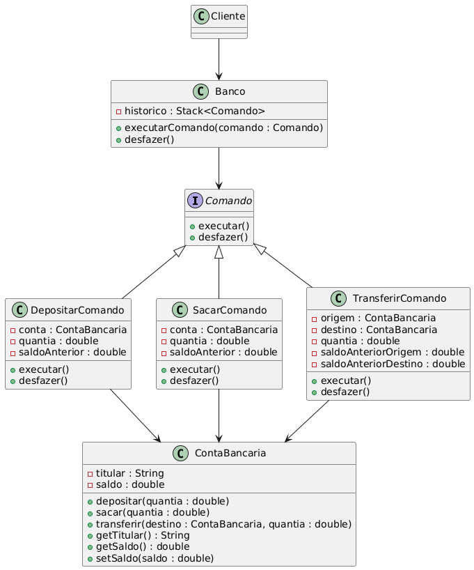

# Projeto de Arquitetura - Design Pattern Command

Este projeto implementa o Design Pattern **Command** em um contexto de operações bancárias. Através deste padrão, comandos como saque, depósito e transferência são encapsulados em classes separadas, permitindo maior flexibilidade e reuso de código.

## Estrutura do Projeto

O projeto é composto pelos seguintes arquivos:

- **Comando.java**: Interface base que define o método `executar()` para todos os comandos.
- **ContaBancaria.java**: Classe que representa uma conta bancária com operações básicas como sacar, depositar e transferir.
- **SacarComando.java**: Implementação do comando para realizar um saque em uma conta bancária.
- **TransferirComando.java**: Implementação do comando para transferir dinheiro entre contas.
- **DepositarComando.java**: Implementação do comando para depositar dinheiro em uma conta bancária.
- **Banco.java**: Classe que atua como invocador dos comandos, centralizando as operações.
- **Cliente.java**: Classe que representa o cliente e é responsável por executar os comandos.
- **uml.png**: Diagrama UML que representa a estrutura do projeto e as interações entre as classes.

## Padrão de Projeto Utilizado

### Command

O padrão Command é um padrão de design comportamental que transforma uma solicitação em um objeto independente que contém todas as informações sobre essa solicitação. Isso permite que o cliente parametrize objetos com diferentes solicitações, enfileire ou registre solicitações, e suporte operações que podem ser desfeitas.

### Vantagens do Padrão Command

1. **Reutilização de Código**: Ao encapsular as operações em classes de comando separadas, é possível reutilizar esses comandos em diferentes contextos, promovendo a reutilização de código.
  
2. **Criação de Macros**: É possível criar sequências de comandos (macros) que podem ser executadas em conjunto. Isso é útil para operações complexas que requerem múltiplas etapas.

3. **Princípio da Responsabilidade Única**: Cada comando tem uma única responsabilidade, o que segue o princípio SOLID de responsabilidade única (SRP). Isso facilita a manutenção e a evolução do código, pois cada classe de comando é independente e encapsula uma única operação.

## Como Executar

1. Compile todas as classes do projeto.
2. Execute a classe `Cliente` para simular operações bancárias utilizando o padrão Command.

## Exemplo de Uso

```java
ContaBancaria conta = new ContaBancaria("12345", 1000);
Comando sacar = new SacarComando(conta, 100);
Comando depositar = new DepositarComando(conta, 200);
Comando transferir = new TransferirComando(conta, new ContaBancaria("67890", 500), 300);

// Executando comandos
sacar.executar();
depositar.executar();
transferir.executar();
```

No exemplo acima, cada operação de saque, depósito e transferência é encapsulada em um comando separado, que pode ser facilmente reutilizado ou combinado com outros comandos.

## Diagrama UML



Este diagrama ilustra a estrutura das classes e a interação entre elas.
